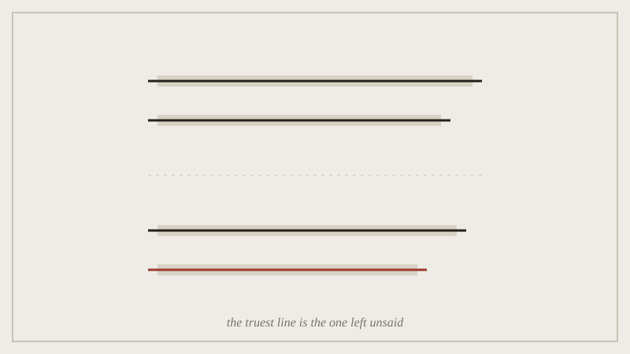

Pseudo-Dionysius's move, put plainly: God is not good, not wise, not real.
Not because those words are false, but because every word we own is borrowed
from the created world, and so is too small for what it describes. Saying so
is more honest than reaching for a bigger word. Maimonides ran the same
argument through strict logic seven centuries later and called it the only
theology that does not end up lying. The Cloud of Unknowing pushed further
again: not just unsayable, but unthinkable, reached by longing rather than by
an idea at all.

*The struck lines are every positive word we tried; the blank one is the sentence apophatic theology keeps by refusing to write it.*

This is not a detour into church history. It is the vocabulary the rest of
the semester borrows. Apophatic means saying by unsaying. Cataphatic means
saying by saying. Every later week turns out to have its own version of that
pair, and naming it here saves us explaining it ten more times.

## Outline

- three apophatic theologians, three different reasons for the same move
- why "unsayable" is not the same claim as "unimportant"
- the vocabulary we're borrowing: apophatic / cataphatic, and where it
  will resurface
