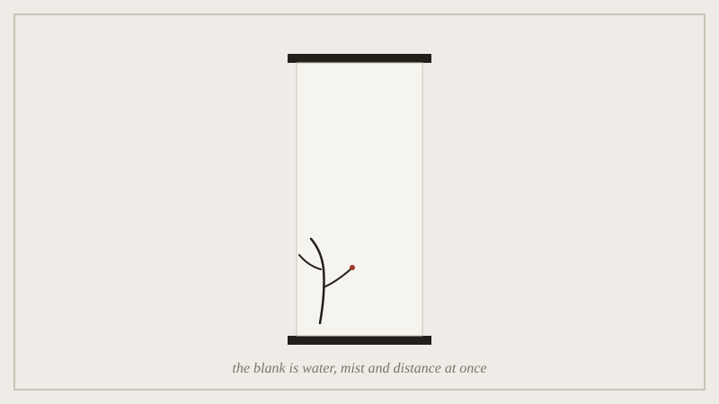

Ni Zan's riverbank scrolls are mostly bare paper. A few trees, a far bank,
almost never a person, and a wide unpainted middle. That middle is not the
background. It is the subject. Literati painters have a word for it,
liubai, which means "leaving white". It is not a trick for saving ink. The
blank does work that no brushstroke could. It reads as water, as mist, and
as distance, and it stays all three at once because the painter never made
it choose.

*The bare silk is not the background behind the branch; it is the water, the mist and the distance the painter declined to settle.*

We saw the same move last week in theology. The unsayable God and the
unpainted silk both refuse to settle on one fixed content. Both claim the
refusal is more true, not just more humble. So what does the blank cost?
A clear picture of any single thing. And what does it buy? All of them at
once. The lecture asks whether this is one idea showing up twice, or two
ideas that only happen to look alike.

## Outline

- liubai and the compositional load an empty ground carries
- Ni Zan as the extreme case: a landscape tradition with the figures
  removed
- a shared structure with last week's theology, and where the analogy
  breaks
