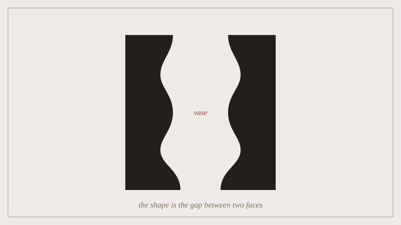

John Pawson's Nový Dvůr monastery comes close to arguing that emptiness
is itself a building material. It has thick walls, plain light, and
almost no furniture. The monks chose him because his other work already
looked like a place built for silence. The lecture sets that against a
more familiar case. The FedEx logo hides an arrow in the gap between the
"E" and the "x." It works because almost nobody sees it on purpose. You
only feel that the mark points forward.

*The vase is nothing but the room the two profiles decline to fill; the gap is doing all the work.*

Both are "negative space" in the loose studio sense, but they do not do
the same work. Pawson's emptiness is the point. It is meant to be
noticed and dwelt in. The FedEx gap is a trick. It is meant to work
without being noticed at all. Leaving the room empty cost Pawson the
comfort of furniture, but it bought a place you can sit in silence.
Hiding the arrow cost FedEx a mark anyone could point to, but it bought
a logo that feels like motion. Confusing those two jobs is where student
negative-space projects usually go wrong.

## Outline

- Pawson's monastery: emptiness as a building material, not an absence of
  one
- the FedEx arrow: a negative space meant to work without being seen
- two different jobs a "gap" can do, and how to tell which one you're
  building
