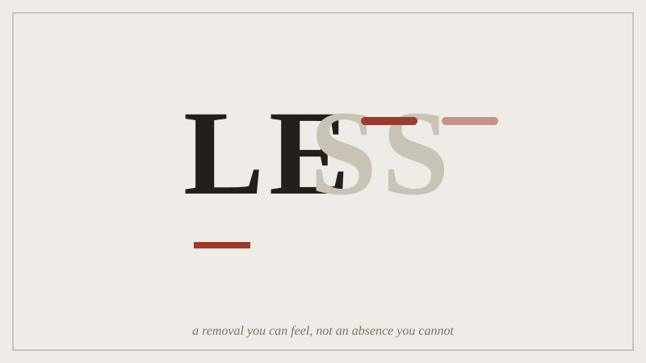

Dieter Rams's tenth principle says "good design is as little design as
possible." People quote it constantly and read it carelessly almost as
often, usually as a licence for blankness. Rams's own products argue the
other way. The Braun T3 radio and the SK4 record player took things out.
They dropped the visible fixings, the ornament, and the controls you did
not need, from designs that used to have them. The object reads as clean
because you can feel that choice, not because nothing is there.

*Less is a verb here, a thing done to the word; the faded letters keep the shape of what was removed.*

Here is the central distinction. A design that took something out still
carries the shape of what it removed, the way a scar carries the shape of
a wound. A design that simply never had the feature was never making an
argument at all. Removing a part costs you the part but buys you a
visible decision. Never adding it costs nothing and buys nothing. Most
bad "minimalist" design is the second kind wearing the first kind's
reputation.

## Outline

- Rams's tenth principle, and the two ways to misread it
- Braun's T3/SK4 as objects that show their own subtraction
- telling "removed" from "never there" in your own studio work so far
