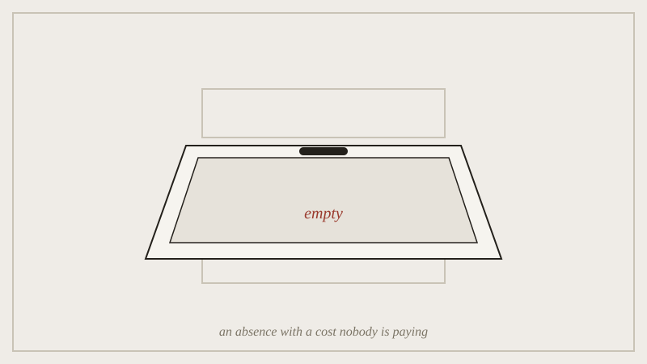

A null result means the hypothesis was not supported. It is exactly as
informative as a positive one. It gets published at a fraction of the
rate, because journals and researchers both prefer a story with a
finding in it. The cost is not just a few missing papers. The published
record ends up a biased sample of reality, weighted toward whatever
happened to work in whichever lab tried it first.

*The result that found nothing is filed here and never counted; this is the one absence in the course nobody chose on purpose.*

This is the first week where leaving something out is not a craft choice
anyone is proud of. It is closer to a structural failure the field is
still arguing about how to fix, through preregistration, registered
reports, and mandatory null-result archives. The lecture treats it as
the semester's harshest test of the course's own thesis. Sometimes what
is missing is not a considered cut at all, just an absence with a cost
nobody is paying attention to.

## Outline

- the file-drawer problem and why it's worse than it sounds
- preregistration and registered reports as attempts to force the null
  result back into the record
- when "what's missing" stops being a design choice and starts being a
  bias
