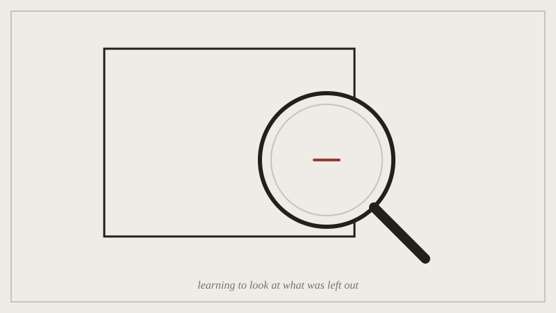

## Before the seminar

Bring one thing you made --- anything finished, in any medium --- and be
ready to name one part of it you thought about removing.

*The warm-up is exactly this: putting the lens on the space where something is missing.*

## In the seminar

We go around the room once: what you brought, and the part you thought
about cutting. No defending yet, just naming. Then a warm-up: everyone
looks at the same short passage (a paragraph from a set text) and marks
the one sentence they'd remove first, silently, before comparing notes.
The disagreement is the point --- if everyone marks the same sentence,
the passage wasn't testing anything.

We close by walking through how the semester's three assessments build
on each other, and what "commonplace book" means if you haven't kept one
before.

## Afterwards

Start the Commonplace Book this week, not next: the earliest entries are
usually the easiest to find and the hardest to reconstruct later.
