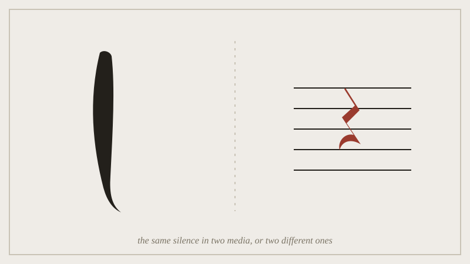

## Before the seminar

Read the two set lectures back to back and write down, in one sentence
each, what the blank silk is doing and what the musical rest is doing.
Bring both sentences on paper --- you'll be asked to defend the difference
between them, not just the similarity.

*The blank silk and the rest, put next to each other so the seminar can argue whether they are the same move.*

## In the seminar

We put a projected scroll detail next to a recording of a rest-heavy
passage and argue the comparison directly: is "leaving it blank" and
"leaving it silent" the same move in two media, or does the visual
field's simultaneity (you see the whole blank at once) make it a
different kind of omission from the rest's sequential one (you wait
through it)? Half the room argues each side, then swaps.

## Afterwards

Add at least one entry to your Commonplace Book from a discipline
neither the painting nor the music lecture covered --- the point of this
week is testing whether the pattern generalises past the two cases we
handed you.
