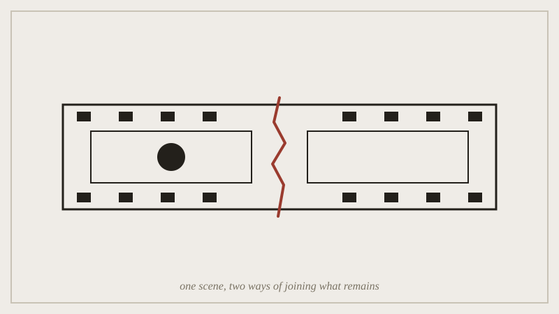

## Before the seminar

No reading; bring headphones. The session opens with two cuts of the
same short scene, one continuity-edited and one Kuleshov-style, and you
watch both cold before anyone tells you which is which.

*Two cuts of the same scene meet at the seam; what each one leaves out is the whole discussion.*

## In the seminar

We watch both cuts, then argue about what each one made you feel that
the other didn't, before checking that against what the lecture claimed
each technique does. Second half moves from screen to space: a walk
through video documentation of Nový Dvůr, with the sound off, testing
whether "negative space" reads the same way in a moving building tour as
it did in the lecture's still photographs.

## Afterwards

Idris holds a studio hour this week specifically for anyone starting "A
Practice in Subtraction" in a time-based medium (film, audio, animation)
--- the technical constraints are different from a static one and worth
raising before you're deep into an edit.
