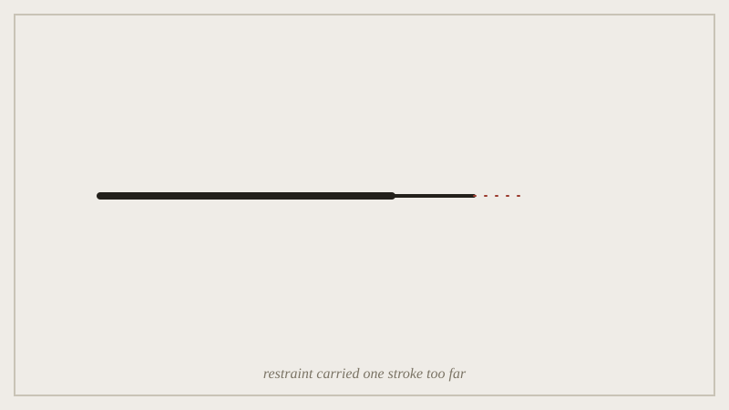

## Before the seminar

Bring a one-paragraph pitch of your final project's argument and, most
importantly, a one-sentence statement of the single thing it depends on
not saying.

*A line held back until it nearly vanishes; the closing question is where restraint stops being a virtue.*

## In the seminar

Everyone pitches in two minutes, and the room's only job is to try to
break the pitch by asking what the argument looks like if the unstated
thing gets said anyway. A pitch that survives its own omission being
spoken aloud is usually stronger for having been tested; one that
collapses has found its real problem three weeks before the deadline
rather than after.

## Afterwards

Both teachers hold open office hours through the following two weeks
specifically for final-project questions --- this is the last seminar of
the semester, but not the last chance to talk about the work.
