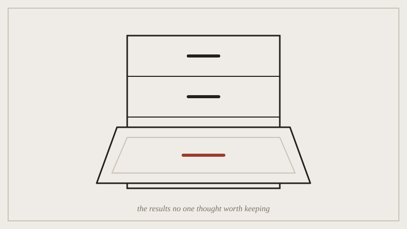

## Before the seminar

Read the short case study circulated after the lecture: a real published
meta-analysis whose conclusions shifted once a batch of unpublished null
results was tracked down and folded back in. Come with an opinion on
whether the original published literature was wrong, or just
incomplete, and whether that distinction matters.

*The file drawer of the case study, opened to show exactly the results that never made it into print.*

## In the seminar

We argue the case study, then turn it back on the course itself: has
this semester's own reading list quietly favoured successful, published
omissions over the failed or costly ones? Second half is working time ---
bring your in-progress "A Practice in Subtraction" piece for quick
feedback rounds, since it's due at the end of next week.

## Afterwards

If your working session feedback suggested your cut isn't legible yet,
this is the point in the semester to fix that, not after submission.
