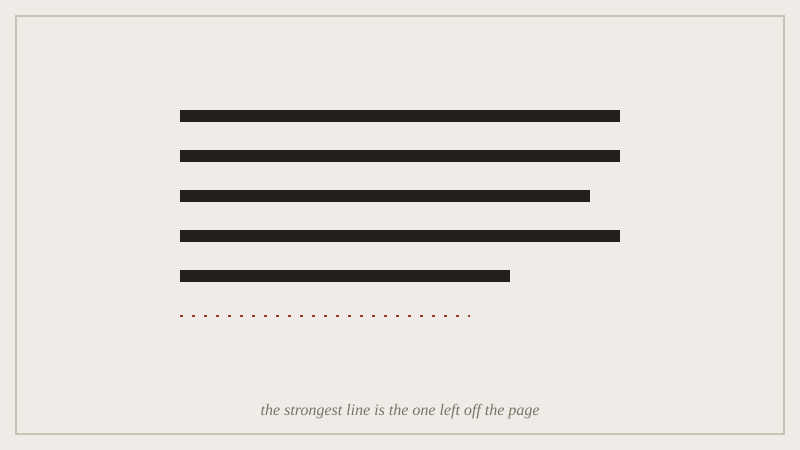

## Before the seminar

Bring your Commonplace Book close to submission-ready. This is the last
seminar before it's due, and the workshop half of the session is your
last structured chance to find gaps in it before marking does.

*Hemingway's iceberg in one plate: the paragraph holds, and the last line is the one deliberately left off.*

## In the seminar

First half: the Hemingway/Lish argument from the lecture, continued ---
specifically the question of whether a cut an editor makes for you
counts the same as a cut you make yourself, or whether authorship of the
omission matters to whether it works. Second half: workshop groups of
three swap Commonplace Books and each flag one entry that reads like a
cut you noticed and one that reads like a cut you're only asserting.

## Afterwards

Revise at least the one flagged entry before submitting. The workshop
exists specifically so that flag doesn't come from a marker for the
first time.
